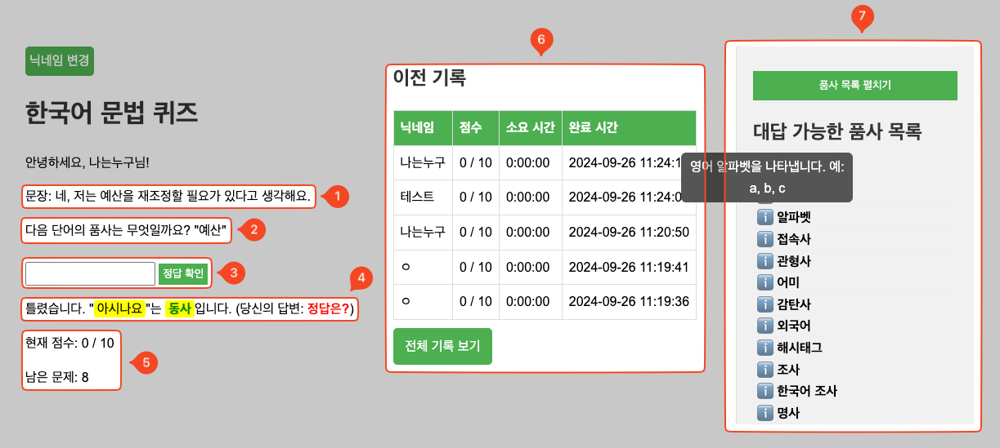

# 사용자 설명

1. [localhost:8000](http://localhost:8000) 접속
2. 닉네임 설정 및 퀴즈 시작

    

    1. 닉네임 입력칸
    2. 퀴즈 시작 버튼

3. 문제 확인 및 정답 확인
    
    
    
    1. 문장
    2. 문제
    3. 정답 입력 및 확인 버튼
    4. 정오답 출력
    5. 현재 점수 및 남은 문제
    6. 이전 기록
    7.  대답 가능한 품사 목록

4. 퀴즈 결과

    

    1. 사용자 리스트
    2. 다시 시작하기 버튼
---

# 관리자 설명

- 기본 데이터 : 한국어-영어 번역(병렬) 말뭉치[[출처]](https://aihub.or.kr/aihubdata/data/view.do?currMenu=115&topMenu=100&dataSetSn=126)
- 개발 환경 :
    - 파이썬 버전 : 3.9.19
    - 데이터베이스 : SQLite3
    - 패키지 설치 : pip install -r requirements.txt
- 프로젝트 실행 방법 :
    - [manage.py](http://manage.py) 파일이 있는 폴더에서 터미널 실행
    - python [manage.py](http://manage.py/) runserver
    - 브라우저에서 http://localhost:8000/ 로 접속
- 프로젝트 종료 방법 :
    - 터미널에서 Ctrl + C
- 관리자 페이지 : http://localhost:8000/admin
    - 관리자 계정 : admin
    - 관리자 비밀번호 : 1234
    - 문장 추가 방법

        

        

        

        

- 폴더 구조
    
    ```markdown
    ├── data : 데이터 폴더
    └── project : 루트 폴더
        ├── korean : 프로젝트 폴더
        ├── korean_app : 앱 폴더
        │   ├── migrations : 마이그레이션 파일
        │   ├── static : 정적 파일
        │   │   ├── css : 스타일 파일
        │   │   └── js : 자바스크립트 파일
        │   └── templates : 템플릿 파일
        │       └── korean_app : 앱 템플릿 파일
        └── utils : 유틸 파일
    ```
    

---

# 요구사항

- 문제를 여러 개 풀 수 있어야 합니다 (10문제)
- 한 차례 문제를 푼 뒤에는, 총점을 확인할 수 있어야 합니다
- 틀린 문제는 실제 정답이 무엇인지를 알 수 있어야 합니다
- 일반 사용자가 사용한다고 가정하고 제작합니다
- 문제는 랜덤하게 출제되어야 합니다
    - 문장 목록에서 랜덤하게 문장 선택
        
        ```python
        sentences = list(Sentence.objects.order_by('?')[:10])
        sentence = random.choice(sentences).text if sentences else "문장이 없습니다."
        
        ```
        
- 개발자가 아닌 관리자가 입력 데이터를 자유롭게 추가할 수 있어야 합니다
    - 관리자 페이지에서 문장 추가 가능(Sentence)
- 사용자가 입력한 답, 정오답 여부, 문제를 푼 시간, 출제된 문제 정보는 로그가 기록되어야 합니다
    - DB에 저장(QuizLog)
    - 관리자 페이지에서 로그 확인 가능
    - 최근 5개의 로그만 보이도록 함

---

### DB 스키마

- Sentence 테이블:
    - id: 기본키
    - text: 문장 텍스트
- QuizResult 테이블:
    - id: 기본키
    - nickname: 닉네임, 기본값 'Anonymous'.
    - score: 퀴즈에서 사용자가 얻은 점수.
    - time_taken: 퀴즈를 푸는 데 소요된 시간.
    - completed_at: 퀴즈 완료 시간
- QuizLog 테이블:
    - id: 기본키
    - quiz_result_id: QuizResult와 연결되는 외래 키.
    - sentence: 문장 텍스트.
    - target_word: 질문 단어.
    - correct_answer: 정답.
    - user_answer: 사용자가 입력한 답.
    - is_correct: 정답 여부를 저장하는 불리언 값.
    - time_taken: 해당 문항에 소요된 시간.
    - created_at: 로그 생성 시간을 저장합니다.

